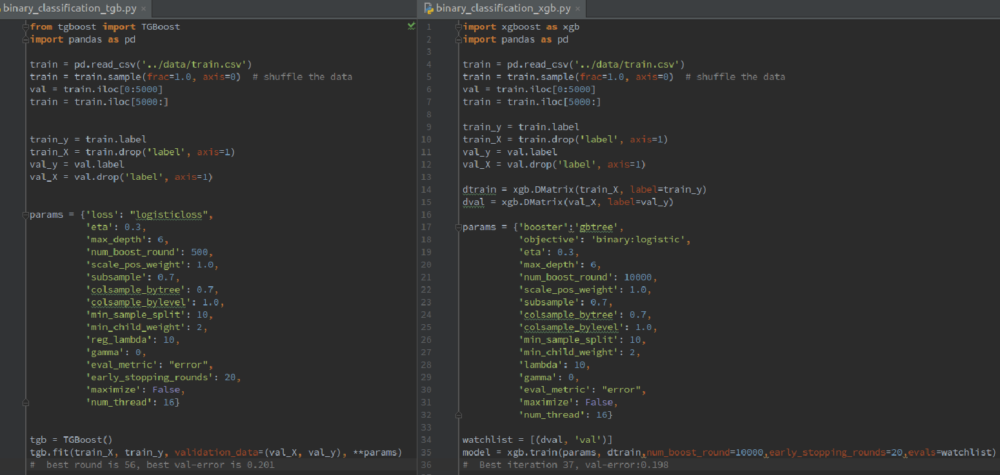

## What is TGBoost

It is a **T**iny implement of **G**radient **Boost**ing tree, based on  XGBoost's scoring function and SLIQ's efficient tree building algorithm. TGBoost first conduct binning on numerical variables (as many histogram based algorithms do), then build the tree in a level-wise way as in SLIQ (by constructing Attribute list and Class list). 

 Briefly, TGBoost supports:

- **Built-in loss**, Square error loss for regression task, Logistic loss for classification task

- **Customized loss**, use `autograd` to calculate the grad and hess automaticly

- **Early stopping**, evaluate on validation set and conduct early stopping.

- **Parallel learning**, when finding best tree node split
	
- **Feature importance**, output the feature importance after training 

- **Regularization**, lambda, gamma (as in xgboost scoring function)

- **Randomness**, subsample，colsample

- **Weighted loss function**, assign weight to each sample.

- **Handle missing value**, XGBoost learn a direction for those with missing value, the direction is left or right. TGBoost take a different approach: it enumerate missing value go to left child, right child and missing value child, then choose the best one. So TGBoost use Ternary Tree.


## Dependence

TGBoost is implemented in `Python 2.7`, use `Numpy ` and  `autograd` .These package can be easily installed using `pip`.


- [Numpy](https://github.com/numpy/numpy)
- [autograd](https://github.com/HIPS/autograd)


## Compared with XGBoost

It is a binary classification task, the dataset can be downloaded from [here](http://pan.baidu.com/s/1c23gJkc). It has 40000 samples and each sample with 52 features, some feature has missing value. The dataset is splited into trainset and validation set, and compare the performance of TGBoost and XGBoost on the validation set.

As the following figure shows, TGBoost get its best result at iteration 56 with **0.201 error rate**. XGBoost gets  its best result at iteration 37 with **0.198 error rate**. They are roughly the same.  However, TGBoost is relatively slow.




## More Example

You can define your own loss function:

```python

from tgboost import tgb
import pandas as pd
import autograd.numpy as anp

train = pd.read_csv('../data/train.csv')
train = train.sample(frac=1.0, axis=0)  # shuffle the data
val = train.iloc[0:5000]
train = train.iloc[5000:]

train_y = train.label
train_X = train.drop('label', axis=1)
val_y = val.label
val_X = val.drop('label', axis=1)


def logistic_loss(pred, y):
    return -(y*anp.log(pred) + (1-y)*anp.log(1-pred))

params = {'loss': logistic_loss,
          'eta': 0.3,
          'max_depth': 6,
          'num_boost_round': 500,
          'scale_pos_weight': 1.0,
          'subsample': 0.7,
          'colsample': 0.7,
          'min_sample_split': 10,
          'min_child_weight': 2,
          'reg_lambda': 10,
          'gamma': 0,
          'eval_metric': "error",
          'early_stopping_rounds': 20,
          'maximize': False,
          'num_thread': 16}

tgb.fit(train_X, train_y, validation_data=(val_X, val_y), **params)

```

## TODO
- support more features, cross validation, scale pos weight, etc

- post prunning

- more testing. evaluate the effectiveness of the method TGBoost use to handle missing value

- Because of Python GIL, TGBoost use multiprocessing instead of threading. However, memory are not shared between subprocess. Thus Attribute list and Class list are copy to each subprocess, which lead to extra memory consumption and Interprocess communication .


## Reference

- [XGBoost: A Scalable Tree Boosting System](https://arxiv.org/abs/1603.02754)
- [SLIQ: A Fast Scalable Classifier for Data Mining](http://citeseerx.ist.psu.edu/viewdoc/download?doi=10.1.1.89.7734&rep=rep1&type=pdf)

- [GBDT算法原理与系统设计简介](http://wepon.me/files/gbdt.pdf)
